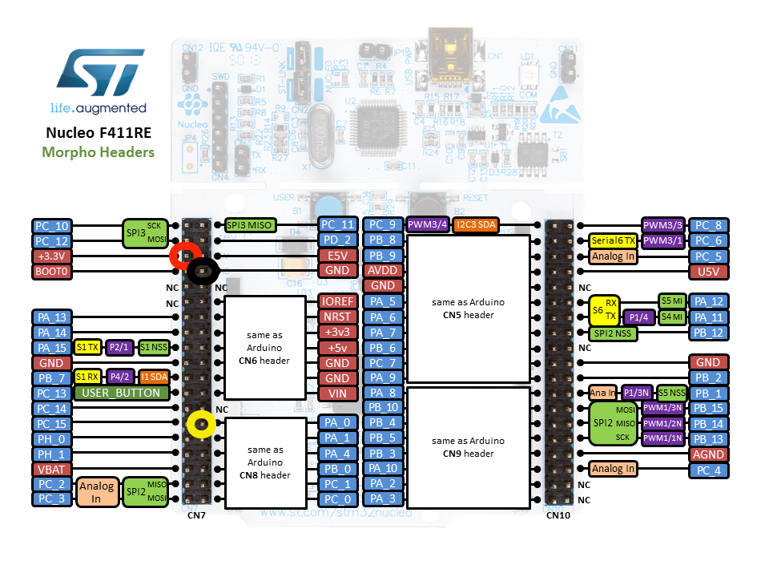

# DSA 2017 - Instructions

Welcome to our IoT session at Data Science Africe 2017! If you have any questions, please just give a shout. We are here to help.

Over the next two days we'll be diving into the Internet of Things by building some smar devices, introducing you to:

* Sensors and actuators.
* Connecting devices to the internet.
* Interacting with devices through the mbed Device Connector API.
* Using Python to retrieve data from these devices.
* Visualizing data.

We will demonstrate everything on stage, but in case you're stuck this document will help you get back on track. We've also listed some additional excercises if you want a challenge.

> If you happen to be much faster than everyone else, help your neighbors.

## Hardware required

You should have:

1. A development board (NUCLEO-F401RE or NUCLEO-F411RE).
1. A USB cable.
1. Some jumper wires.
1. A WiFi chip.
1. A soil moisture sensor.
1. An accelerometer.
1. A temperature sensor.

## Prerequisites

We need to install a few pieces of software that we'll be using.

On your computer:

1. Install a recent version of [node.js](https://nodejs.org) (4.x or higher).
1. Download the source code for this workshop from [here](https://github.com/ARMmbed/dsa-2017) - and unpack in a convenient location.

### Windows

If you are on Windows, also install:

1. [ST Link](http://janjongboom.com/downloads/st-link.zip) - serial driver for the board.
    * Run `dpinst_amd64` on 64-bits Windows, `dpinst_x86` on 32-bits Windows.
    * Afterwards, unplug your board and plug it back in.
    * (Not sure if it configured correctly? Look in 'Device Manager > Ports (COM & LPT)', should list as STLink Virtual COM Port.
1. [Tera term](https://osdn.net/projects/ttssh2/downloads/66361/teraterm-4.92.exe/) - to see debug messages from the board.

## Setup

1. Take your NUCLEO board out of the box.
1. Connect a mini-USB cable to the board.
1. The board mounts as a mass-storage device (like a USB drive). Verify that you can see it (the drive name will be NUCLEO).
1. Double-click on `mbed.htm` - you'll be redirected to the [F411RE platform page](https://developer.mbed.org/platforms/ST-Nucleo-F411RE/).
    * If prompted to sign in, sign in or create an account.
1. Click the **Add to your mbed Compiler** button.
1. Click the **Compiler** button.
1. An IDE should open. Congratulations!

**Local development:** If you like things locally, you can do so by using [mbed CLI](https://docs.mbed.com/docs/mbed-os-handbook/en/5.1/getting_started/blinky_cli/#installing-mbed-cli-and-a-toolchain). I very much recommend to just use the online IDE, as it makes it easier for us, but if you want to continue hacking in the future, this is a nice way.

## 1. Playing with inputs

There is a button (the blue one) on your board. Let's see if your board actually works by responding to a click on this button.

1. Make sure that you have the online compiler open.
1. Click the Import button, then click **Click Here to import from URL**.
1. Paste the following URL: https://github.com/ARMmbed/dsa-2017
    * Do **NOT** tick the 'Update libraries' checkbox.
1. Click the **Import** button.
1. In the top right corner, verify that the right development board is selected (NUCLEO-F411RE or NUCLEO-F401RE).

Next, we will select which program we will build. This step needs to be repeated every time we progress to the next example.

1. In the tree, locate 'select_project.h'.
1. Change the number in this file to the project you want to build. In this case `1`.

Now we can implement the code to make the button do something. Open ``1_button/main.h`` and under 'YOUR CODE HERE' add the following code:

```cpp
// A DigitalOut object has a state on or off (only two states)
DigitalOut led(LED1);

void toggle_led() {
    // When this function gets executed we toggle the state of the LED
    led = !led;
}
```


1. Now press Compile.
1. A file downloads.
1. Drag the file to the 'NUCLEO' disk.
1. The device flashes red/yellow when it's updating the software.
1. Press the `RESET` button on the board (only needed sometimes).

Now click the blue button and see the LED toggle.

### Optional

Change the code so that the LED will only be on when you're holding the button, and turns off when you release the button (hint: `fall` has a brother called `rise`).

## 2. Reading data from a sensor

To make things more interesting, let's read data from a soil moisture sensor. You can use this sensor to monitor whether your plant needs to be watered, but it can also detect when you touch it (because your fingers are more moist than the air). Let's turn the soil moisture sensor into a capacitive touch sensor!

### Wiring it up

1. Take the moisture sensor.
1. Attach the grove connector.
1. Click in three wires at the bottom of the grove connector (leading to red, black, yellow).
1. Connect to the board as follows (the actual colors of the wires does not matter, but where you connect them does!).



### Coding it up

We can now write a small program that checks on the moisture sensor, and responds when it detects a moist environment (like your hands).

1. In the tree, locate 'select_project.h' and change the number in this file to `2`.
1. Open `2_capacitive\main.h` and under `YOUR CODE HERE` add:

    ```cpp
            // Read the value of the sensor
            float moist = moisture.read();
            // Print it back to the computer
            printf("Moisture value is %f\r\n", moist);

            // If we're > 10% moist, then toggle the LED
            if (moist > 0.10) {
                led = 1;
            }
            else {
                led = 0;
            }

            // Pause between readings
            wait_ms(100);
    ```

1. Compile and flash the program.
1. When you now touch the sensor the LED should turn on.

## Showing debug messages

All nice, but you have no insight in how well the program works. Debug messages to the rescue! To show debug messages we need a serial monitor. Follow the instructions below. Your output should be similar to:

```
Moisture value is 0.000733
Moisture value is 0.001465
Moisture value is 0.001465
Moisture value is 0.000733
Moisture value is 0.000244
Moisture value is 0.000488
Moisture value is 0.000488
```

### Windows

To see debug messages, install,

1. [ST Link](http://janjongboom.com/downloads/st-link.zip) - serial driver for the board.
    * See above for more instructions.
1. [Tera term](https://osdn.net/projects/ttssh2/downloads/66361/teraterm-4.92.exe/) - to see debug messages from the board.

When you open Tera Term, select *Serial*, and then select the STLink COM Port. Make sure to select `115200` as baud rate.


### OS/X

No need to install a driver. Open a terminal and run:

```
screen /dev/tty.usbm            # now press TAB to autocomplete, then add 115200

# f.e.
# screen /dev/tty.usbmodem1423 115200
```

To exit, press: `CTRL+A` then `CTRL+\` then press `y`.

### Linux

If it's not installed, install GNU screen (`sudo apt-get install screen`). Then open a terminal and find out the handler for your device:

```
$ ls /dev/ttyACM*
/dev/ttyACM0
```

Then connect to the board using screen:

```
sudo screen /dev/ttyACM0 115200                # might not need sudo if set up lsusb rules properly
```

To exit, press `CTRL+A` then type `:quit`.

## 3. Connecting to mbed Device Connector

Now that we have a basic program running, we can connect it to the internet through mbed Device Connector.

### Wiring

First, we need to connect the WiFi module to the board. Connect the following pins on the WiFi module to the dev board using female->male header wires.


The pins that you need to use are highlighted here:


### Security certificate

Next, we need to obtain a security certificate:

1. Go to [connector.mbed.com](https://connector.mbed.com) and sign in with your mbed credentials.
1. Click on 'Security credentials'.
1. Click on **Get my device security credentials**.
1. Copy the content of the gray box.
1. Create a new file ``security.h`` in the root folder of the project in the online compiler, and paste.

### Writing some code

Now change the project and write some code:

1. Open `mbed_app.json` and add the WiFi SSID and password.
1. In the tree, locate 'select_project.h' and change the number in this file to `3`.
1. This program is essentially the same as the last one, only:
    * It contains code to connect to the internet.
    * It uses a 'cloud variable', a variable that automatically syncs with the cloud to store data.
1. Under `YOUR CODE HERE` paste:

```cpp
// Moisture sensor
AnalogIn moistureSensor(A0);

// Cloud variable. If you update this variable, it will automatically stream it's new value to the cloud.
SimpleResourceFloat moistureResource = client.define_resource("moisture/0/value", 0.0f);

void update_moisture() {
    moistureResource = moistureSensor.read();
}
```

1. Compile and run this program.
1. When connection to the internet succeeded the built-in LED will burn.
1. LED should still go on when moving in front of the sensor.

Your device should now show as registered on: [Connected devices in mbed Device Connector](https://connector.mbed.com/#endpoints) (type: dsa-sensor).

## 4. Interacting with the device

We can now control the device from the mbed Device Connector API Console. In the previous section we created one cloud variable:

* `moisture/0/value` - Value of the moisture sensor.

We can interact with these variables through the [API Console](https://connector.mbed.com/#console).

1. In the API Console select 'Endpoint directory lookup'.
1. Select 'GET /endpoints/{endpoint-name}/{resource-path}'.
1. Under 'endpoint' select your device.
1. Under 'resource-path' select '/motion/0/value'.
1. Click **TEST API**.
1. Touch the moisture sensor.
1. Click **TEST API** again.
1. Verify that the number changed.

## 5. From code

We can also write some code to interact with this device.

1. First make sure that you have installed Python 2.7 or Python 3 and pip.
1. Download the source code for this workshop from [here](https://github.com/ARMmbed/dsa-2017/archive/master.zip) - and unpack in a convenient location.
1. Open a terminal or a command window.
1. Change directory to the folder where you download the `dsa-2017` repository.
1. Run `cd 5_from_code`.
1. Run `pip install -U mbed-connector-api`.
1. Open `main.js` in a text editor.

Now we need an access key (API key).

1. Go to the [Access Keys](https://connector.mbed.com/#accesskeys) page.
2. Click **Generate new key**
3. Copy the key, and paste it in `moisture.py` on the first line.
4. Go back to the terminal.
5. Run `python moisture.py`.

Output should be something like:

```
Found 1 moisture sensors [ { name: '2bffcc03-05a6-4921-b345-ebddb52f6f71',
    type: 'dsa-sensor',
    status: 'ACTIVE' } ]
```

1. Data should now start streaming into your terminal.

## 6. An app

Optionally, you can also run a web app to see live data flowing from the device. For this you'll need a recent version of node.js installed.

1. In your terminal navigate to the `6_an_app` folder.
1. Run `npm install`.
1. Open `main.js` and paste your access key in again.
1. Run `node main.js`.
1. Output should be something like:

```
connected to mbed Cloud, retrieving initial device model
got devices [ { name: '2bffcc03-05a6-4921-b345-ebddb52f6f71',
    type: 'dsa-sensor',
    status: 'ACTIVE',
    endpoint: '2bffcc03-05a6-4921-b345-ebddb52f6f71' } ]
subscribed to 2bffcc03-05a6-4921-b345-ebddb52f6f71 /moisture/0/value
en0 192.168.1.11
Web server listening on port 5265!
```

1. Go to http://localhost:5265 and you can now interact with your devices.

## 7. Other sensors

This should give you enough basic information on how you can connect sensors to the internet, how to get data back from the sensors and then process it through Python or node.js. But this was only a single sensor! We also have temperature sensors and accelerometers (enough for everyone). Gather together and see if you can connect these to the internet as well!

* [3-axis accelerometer 16G](https://developer.mbed.org/cookbook/ADXL345-Accelerometer)
    * Connect black->GND, red->3.3V (any will do), yellow->SCL, white->SDA. See the pinout for your board.
    * For the test code, see how we read the value of the moisture sensor every second. Do something similar.
    * To add the library to your project, right click on your project, select 'Add library' > 'From URL' and select https://developer.mbed.org/users/peterswanson87/code/ADXL345_I2C/.
    * Then, in the **library folder** remove 'mbed' and 'main.cpp'.
    * Initialize using `ADXL345_I2C accelerometer(D14, D15);`.
* [3-axis accelerometer 3G](https://developer.mbed.org/cookbook/Grove-3-axis-Accelerometer)
    * Connect black->GND, red->3.3V (any will do), yellow->SCL, white->SDA. See the pinout for your board.
    * For the test code, see how we read the value of the moisture sensor every second. Do something similar.
    * To add the library to your project, right click on your project, select 'Add library' > 'From URL' and select https://developer.mbed.org/users/edodm85/code/MMA7660FC.
    * Initialize using `MMA7660FC accelerometer(D14, D15, ADDR_MMA7660);`
* [Temperature sensor](https://developer.mbed.org/teams/Seeed/wiki/Analog-Temperature-Sensor)
    * Works the same as the moisture sensor (analog sensor).
    * Connect black->GND, red->3.3V, yellow to A1.
    * Returns a value between 0 and 1.
    * Code example is in the component page, no library required.


### Buffering data

If you want to gather a lot of data (e.g. movement data from accelerometer), better not use a cloud variable for every action, as they are slow. Gather a few seconds of data, concat it, and then upload it all in one go.

E.g.:

```
#include <sstream>

std::stringstream ss;
AnalogIn temp(A3);

int readings_done = 0;

void read_sensor() {
    // add the value to the stringstream
    ss << temp.read_u16();
    ss << ",";

    readings_done = readings_done + 1;
    if (readings_done > 100) {
        some_cloud_var = ss.str(); // assign the total string to a cloud variable
        ss.str(""); // clear the stringstream

        readings_done = 0; // and reset the number of readings done again
    }
}
```

**Note:** By default you can store about 1000 bytes in a cloud variable.
